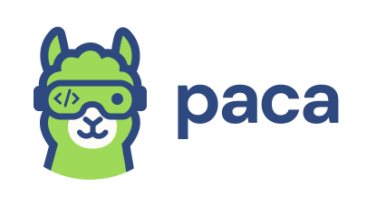

<p align="center">
  
</p>

<h1 align="center">Paca</h1>

<p align="center"><strong>AI-native. Free. Lightweight. Open-source.<br/>The fully customizable alternative to Jira, Trello, ClickUp, and Monday.</strong></p>

<p align="center">
  <a href="https://github.com/Paca-AI/paca/blob/master/LICENSE"></a>
  <a href="https://github.com/Paca-AI/paca/releases"></a>
  <a href="https://github.com/Paca-AI/paca/stargazers"></a>
  <a href="https://artifacthub.io/packages/helm/paca/paca"></a>
</p>

<p align="center"><sub>✨ Sponsored by</sub></p>

<p align="center">
  <a href="https://aws.amazon.com" title="Sponsored by AWS"></a>
  &nbsp;&nbsp;
  <a href="https://neon.com" title="Sponsored by Neon"></a>
  &nbsp;&nbsp;
  <a href="https://m.do.co/c/cce1c135acd1"></a>
  &nbsp;&nbsp;
  <a href="https://app.virtuals.io/referral?code=rXZ9nf"></a>
</p>

<p align="center">
  <a href="#getting-started">Getting Started</a>
  ·
  <a href="#mcp-server--connect-any-ai-agent-to-paca">MCP Server</a>
  ·
  <a href="#paca-skills--claude-code-gemini-cli-cursor-and-more">Paca Skills</a>
  ·
  <a href="docs/architecture/overview.md">Architecture</a>
  ·
  <a href="CONTRIBUTING.md">Contributing</a>
  ·
  <a href="ROADMAP.md">Roadmap</a>
</p>

---

## What is Paca?

Paca is a **self-hosted project management platform** where AI agents and humans collaborate as equal teammates inside a Scrum team — not as chatbots bolted on the side.

Jira gives you a backlog. ClickUp gives you automations. Monday gives you dashboards. **Paca gives your AI agents a seat at the table.** They join sprint planning, pick up tasks from the board, write BDD specs, and adapt alongside humans in real time.

Everything about Paca — its workflow, its data model, its UI — is **configurable and extendable via plugins**.

---

## Why Paca?

| | Jira / Trello / ClickUp / Monday | **Paca** |
|:--|:--|:--|
| **AI integration** | Chatbot add-ons, peripheral automation | AI agents as first-class Scrum teammates |
| **Collaboration model** | Human-only by default | Human + AI, side by side on the same board |
| **Hosting** | Vendor cloud (your data, their servers) | Self-hosted, you own everything |
| **Cost** | $8–$20+ per seat/month | **Free forever** |
| **Customization** | Limited; locked behind enterprise tiers | **Fully open: configuration + plugins** |
| **Weight** | Bloated feature sprawl | Lightweight core; extend only what you need |
| **Source** | Closed / proprietary | **100% open-source (Apache 2.0)** |

---

## Core Idea: Humans and AI Agents, One Scrum Team

The central insight behind Paca is that **AI agents should participate in the Scrum process**, not just generate output in isolation.

In Paca, AI agents:

- Are **assigned to sprints** and appear on the Scrumban board alongside human teammates
- **Pick up tasks** from the backlog and update their status in real time
- **Collaborate on BDD specs** — helping Product Owners and BAs write Gherkin scenarios
- **Contribute to System Design Documents** — keeping the architecture visible to the whole team
- **Probe, sense, and respond** to emerging complexity, just like a human would

This is not automation. It is **genuine collaboration** — rooted in the Cynefin / Stacey framework's recognition that complex domains require teams, not pipelines.

<p align="center">
  
</p>

---

## Fully Customizable — Configuration and Plugins

Paca ships as a small, focused core. Everything else is optional.

**Configuration-driven:** workflows, statuses, field definitions, board layouts, sprint rules, and agent behavior are all driven by project-level configuration files. No code needed to adapt Paca to your team's process.

**Plugin system:** extend or replace any part of Paca via plugins. Plugins are compiled to **WebAssembly (WASM)** for the backend (write in Go, Rust, AssemblyScript — anything with a WASM target) and standard module bundles for the frontend. Plugins run in a sandboxed environment with a capability-based permission model; they declare exactly what host functions they need, and nothing more.

```
plugins/
├── backend/        # WASM modules — add custom routes, logic, data models
└── frontend/       # UI modules — add custom pages, board views, widgets
```

Browse and install community plugins directly from the **Plugin Marketplace** inside the Paca UI — no command line required. Go to **Settings → Plugins → Marketplace**, find a plugin, and click **Install**.

<p align="center">
  
</p>

For local development or custom plugins, you can also install from the filesystem:

```bash
./scripts/install-local-plugin.sh ./my-plugin --api-key <your-api-key>
```

---

## The P-A-C-A Cycle

Paca structures team collaboration around four phases that mirror both Scrum and the scientific method:

```
Plan  →  Act  →  Check  →  Adapt
  ↑                             |
  └─────────────────────────────┘
```

| Phase | What happens |
|:--|:--|
| **Plan** | POs, BAs, and AI agents collaboratively refine the backlog. BDD scenarios and SDD designs are written together. |
| **Act** | Sprint is live. Humans and AI agents pull tasks from the board, execute, and post updates. |
| **Check** | QA agents run automated verification. Humans review AI output. The board reflects reality. |
| **Adapt** | Data from the sprint informs the next cycle. The team — human and AI — retrospects together. |

---

## What's New in v0.12.0

- **Workspace branding** — customize your workspace's logo, favicon, and primary accent color from **Settings → Workspace Branding**. Upload a logo and favicon (PNG, JPEG, WEBP, or GIF, up to 5 MB) and pick from a curated set of accent colors, each with matching light- and dark-mode variants applied automatically across buttons, highlights, the sidebar, and the login screen.

---

## What's New in v0.11.0

- **Event-driven automation engine** — a complete redesign of the automation system into a visual, n8n-style graph builder. Compose **Trigger → Condition → Action** flows on an interactive canvas with multi-branch switch logic, an `Else` fallback path, and nine built-in trigger types — including UTC cron schedules, due-date offsets, task-dependency gates, and inbound webhooks with secret-token auth. Actions can **retarget linked tasks** (parent, children, blockers, or explicit picks) with automatic fan-out, **dispatch AI agents** with custom prompts, or **call external APIs**. Every run is traced step-by-step in a new **Run History** panel, and a project-wide **Dependency Map** visualizes cross-task automation relationships. Plugins can contribute custom trigger, condition, and action node types via WASM.

<p align="center">
  
</p>

---

## What's New in v0.10.0

- **ACP agent support** — connect any [Agent Client Protocol](https://agentclientprotocol.com) coding CLI as a Paca AI agent: Claude Code, Codex, Gemini CLI, or a custom ACP server. A lightweight local bridge (`paca-acp-bridge`) runs from your project's source directory and streams the conversation back to Paca over an authenticated WebSocket — no code is cloned into a cloud sandbox, and the agent uses your own local auth, git/`gh` credentials, and whatever MCP servers or skills you've already set up for that CLI. See [apps/acp-bridge/README.md](apps/acp-bridge/README.md) for setup.

---

---

## What's New in v0.4.0

- **In-app AI chat** — chat with AI agents at the project level to plan work, create or update epics, stories, tasks, and documentation — all in plain English without leaving Paca

<p align="center">
  
</p>

- **Activity diff & revert** — every field change in the activity pane now shows a before/after diff; one click reverts a change to its previous value

<p align="center">
  
</p>

---

## Key Features

- **Unified Scrumban Board** — humans and AI agents share a single real-time board; no separate "AI workspace"
- **In-app AI chat** — chat with AI agents at the project level to plan work, create or update epics, stories, tasks, and documentation in plain English
- **Activity diff & revert** — see a visual diff for every field change in the activity pane and revert any change with one click
- **BDD Collaboration** — Gherkin scenario editor co-authored by POs, BAs, and AI agents
- **System Design Documents (SDD)** — living architecture docs that keep AI agents contextually grounded
- **MCP Server** — connect Claude, custom agents, or any MCP-compatible tool directly into Paca's data layer
- **Claude Code skill** — `/paca` slash command for Claude Code; manage tasks, docs, and sprints in plain English without leaving your editor
- **Real-time updates** — Socket.IO delivery; everyone sees changes the moment they happen
- **OpenHands-powered agents** — AI agents run on the [OpenHands](https://github.com/All-Hands-AI/OpenHands) SDK; each agent executes inside its own isolated sandbox container so your host environment is never touched
- **WASM plugin sandbox** — extend Paca safely; plugins cannot escape their declared permissions
- **Self-hosted** — runs on a single Docker Compose command; your data never leaves your infrastructure
- **Lightweight by default** — minimal core, no feature bloat; add only what your team actually needs

---

## Getting Started

### Option 1 — Interactive install script (recommended for production)

Runs on any Linux server with Docker. No repository clone required.

```bash
curl -fsSL https://github.com/Paca-AI/paca/releases/latest/download/install.sh | bash
```

The script walks you through configuration interactively and starts the full stack. Open `http://your-server-ip` when it finishes.

<p align="center">
  
</p>

**Non-interactive (CI, scripts, AI coding agents):** set `PACA_YES=1` — required for
unattended use, since without it the script can block on a prompt with nobody there
to answer it. Every other setting (database, storage, domain/HTTPS, AI agent, secrets)
can be steered with an environment variable instead of accepting its default:

```bash
PACA_YES=1 bash <(curl -fsSL https://github.com/Paca-AI/paca/releases/latest/download/install.sh)
```

> **If you are an AI agent installing Paca on someone's behalf:** use this script
> rather than hand-writing `docker-compose.yml` / `.env` yourself — it pins
> compatible image tags and generates every secret in the format the services
> expect, so it's far less likely to drift from what a given release needs. See
> [deploy/README.md](deploy/README.md#non-interactive-install-ci-scripts-ai-coding-agents)
> for the full environment variable reference, or the comment header at the top of
> [`scripts/install.sh`](scripts/install.sh) for the same reference inline with the script.
>
> Prefer a manual Docker Compose setup, or a local dev environment instead? See
> [deploy/README.md](deploy/README.md#manual-setup) and
> [docs/guides/local-development.md](docs/guides/local-development.md).

---

### Upgrading to a new version

From the directory where your `docker-compose.yml` and `.env` live, run the upgrade
script published with each release — it refreshes `docker-compose.yml` and the
Caddyfile (with backups) and restarts the stack:

```bash
curl -fsSL https://github.com/Paca-AI/paca/releases/latest/download/upgrade.sh -o upgrade.sh
bash upgrade.sh
```

Database migrations run automatically on API startup. Non-interactive (CI, AI agents): set `PACA_YES=1`, same as `install.sh` — see [deploy/README.md](deploy/README.md#upgrading-to-a-new-version) for the full env var reference, pinning a specific version, or passing through `--scale` flags.

---

### Option 2 — Kubernetes (Helm chart)

For running Paca on an existing Kubernetes cluster instead of a single Docker host. No repository clone required — the chart is published as an OCI artifact alongside every other release image.

```bash
kubectl create namespace paca
helm install paca oci://ghcr.io/paca-ai/charts/paca --version <release-version> -n paca -f my-values.yaml
```

`<release-version>` is a [release](https://github.com/Paca-AI/paca/releases) tag without its leading `v` (e.g. `0.13.1` for `v0.13.1`); omit `--version` to install the newest chart published. At minimum, `my-values.yaml` needs `publicUrl` and the required secrets (`jwtSecret`, `adminPassword`, `encryptionKey`, and others) — there are no guessable defaults, so the chart refuses to render without them.

See [Artifact Hub](https://artifacthub.io/packages/helm/paca/paca) for the full values reference, exposing the app via Ingress/TLS or a LoadBalancer, what's bundled vs. pointing at managed Postgres/Redis/S3, the AI agent sandbox's Kubernetes-specific RBAC, and troubleshooting.

---

## MCP Server — Connect Any AI Agent to Paca

Paca ships an [MCP (Model Context Protocol)](https://modelcontextprotocol.io) server that gives any compatible AI agent direct, structured access to your workspace — projects, tasks, sprints, documents, members, and more. No scraping, no custom APIs to wire up.

The server is published as **`@paca-ai/paca-mcp`** on npm. You run it with `npx`; your MCP client handles the rest.

### Claude Desktop

1. Open (or create) the Claude Desktop config file:
   - **macOS**: `~/Library/Application Support/Claude/claude_desktop_config.json`
   - **Windows**: `%APPDATA%\Claude\claude_desktop_config.json`

2. Add the `paca` entry:

```json
{
  "mcpServers": {
    "paca": {
      "command": "npx",
      "args": ["-y", "@paca-ai/paca-mcp"],
      "env": {
        "PACA_API_KEY": "your-api-key-here",
        "PACA_API_URL": "http://localhost:8080"
      }
    }
  }
}
```

3. Restart Claude Desktop. Claude now has access to all Paca tools and can answer requests like:
   - *"List all active sprints in project X"*
   - *"Create a task for implementing OAuth and assign it to sprint 3"*
   - *"Add a comment to task #42 with my progress update"*

### Other MCP-Compatible Clients

Any client that speaks MCP works. Typical configuration:

```json
{
  "name": "paca",
  "command": "npx",
  "args": ["-y", "@paca-ai/paca-mcp"],
  "env": {
    "PACA_API_KEY": "your-api-key-here",
    "PACA_API_URL": "http://your-paca-instance:8080"
  }
}
```

### Environment Variables

| Variable | Required | Default | Description |
|:--|:--|:--|:--|
| `PACA_API_KEY` | Yes | — | API key from your Paca instance (Settings → API Keys) |
| `PACA_API_URL` | No | `http://localhost:8080` | URL of your Paca API |

### Available Tools

The server exposes tools across these categories:

| Category | Tools |
|:--|:--|
| Projects | `list_projects`, `get_project`, `create_project`, `update_project`, `delete_project` |
| Tasks | `list_tasks`, `get_task`, `create_task`, `update_task`, `delete_task`, + more |
| Sprints | `list_sprints`, `create_sprint`, `update_sprint`, `complete_sprint`, + more |
| Documents | `list_documents`, `get_document`, `create_document`, `update_document`, `delete_document` |
| Members & Roles | `list_project_members`, `add_project_member`, `list_project_roles`, + more |
| Task Types & Statuses | `list_task_types`, `create_task_type`, `list_task_statuses`, + more |
| Views & Custom Fields | `list_views`, `create_view`, `list_custom_fields`, `create_custom_field`, + more |
| Attachments | `list_task_attachments`, `get_attachment_download_url`, `delete_task_attachment` |
| Activity & Comments | `list_task_activities`, `add_task_comment`, `update_task_comment`, `delete_task_comment` |
| Plugin tools | Installed plugins can register additional tools at runtime |

For a complete reference and advanced configuration (agent-mode, plugin tools, programmatic usage), see [docs/guides/mcp-server-setup.md](docs/guides/mcp-server-setup.md).

---

## `/paca` skills — Claude Code, Gemini CLI, Cursor, and more

Install the Paca skill set and manage your entire Paca workspace through natural-language slash commands — without leaving your editor and without creating local files. Every command reads your Paca documentation first to understand the project before acting.

Skills use the [Agent Skills](https://agentskills.io/specification) format (YAML frontmatter + instructions) and are served by a running Paca instance's own API (`GET /api/v1/skills`), not read from a checked-out directory — so installed content always matches the exact version that instance runs. The install script fetches and installs them to [Claude Code](https://claude.ai/code) (`~/.claude/commands/`), Gemini CLI (`~/.gemini/commands/`), Cursor (`.cursor/commands/`, project-scoped), and any AGENTS.md-reading tool (project-scoped) in one pass, and also pulls in skills contributed by your installed plugins. See [docs/guides/install-skills.md](docs/guides/install-skills.md) for details.

### Install

Point the installer at a running Paca instance and run this once in your terminal to install all skills to every supported platform found on this machine:

```bash
PACA_API_URL=http://localhost:8080 \
  curl -fsSL https://raw.githubusercontent.com/Paca-AI/paca/master/scripts/install-paca-skills.sh | bash
```

Then connect the Paca MCP server to Claude Code:

```bash
claude mcp add paca \
  --env PACA_API_KEY=<your-api-key> \
  --env PACA_API_URL=<your-paca-url> \
  -- npx -y @paca-ai/paca-mcp
```

Run `/paca-setup` inside a Claude Code session for a guided interactive walkthrough instead.

### Available commands

| Command | What it does |
|:--|:--|
| `/paca <request>` | General task, doc, and sprint operations in plain English |
| `/paca-epic <requirements>` | Turn requirements into an epic with child stories and a spec doc |
| `/paca-clarify <task-or-doc>` | Identify ambiguities, ask questions, and update the spec in Paca |
| `/paca-breakdown <task>` | Decompose a task into independent, estimable sub-tasks |
| `/paca-sprint` | Plan a sprint from the backlog against capacity and goals |
| `/paca-estimate <task(s)>` | Estimate story points and write them back to tasks |
| `/paca-prioritize` | Score and set priorities across the backlog |
| `/paca-do <task>` | Execute a task, update its status, and keep docs current |
| `/paca-test <task>` | Derive test cases, run them, and record results as a comment |
| `/paca-doc <task-or-topic>` | Write or update documentation in Paca Docs |
| `/paca-setup` | Interactive MCP connection wizard |

For full setup options and command reference, see [docs/guides/install-skills.md](docs/guides/install-skills.md).

---

## Architecture

```
apps/web              React + TanStack Start + shadcn/ui — user interface
apps/mcp              @paca-ai/paca-mcp — MCP server for AI agent integration
services/api          Go + Gin — core business logic and REST API
services/realtime     Node.js + Socket.IO — real-time event fan-out
services/agent-runner Go — AI agent execution (Goose over ACP)
services/agent-server Docker image for the Goose sandbox agent-runner spawns per conversation
apps/e2e              Playwright — end-to-end test suite

PostgreSQL        Persistent store
Valkey            Cache + async event streams between services
```

See [docs/architecture/overview.md](docs/architecture/overview.md) for detail.

---

## The "Paca" Story

The name is a small pun on the Japanese word **"Baka" (ばか)** — "silly."

In the early days, we jokingly called our AI assistants "silly" when they hallucinated. And building a serious project management platform as a free, open-source alternative to multi-billion-dollar tools might also seem a bit silly.

But Paca is built from conviction: human-AI collaboration in a real Scrum team should be accessible to every team, everywhere — not locked behind a vendor's pricing model. We think that's worth being a little foolish about. 🦙✨

---

## Documentation

| Document | Description |
|:--|:--|
| [docs/architecture/overview.md](docs/architecture/overview.md) | High-level system architecture |
| [docs/guides/getting-started.md](docs/guides/getting-started.md) | Getting started (install, Docker, local dev) |
| [docs/guides/local-development.md](docs/guides/local-development.md) | Contributor dev environment setup |
| [docs/guides/mcp-server-setup.md](docs/guides/mcp-server-setup.md) | Connect AI agents via MCP |
| [docs/guides/install-skills.md](docs/guides/install-skills.md) | `/paca` skill for Claude Code — manage Paca from your editor |
| [apps/extension/README.md](apps/extension/README.md) | Browser extension — comment on environment preview pages, turn comments into tasks |
| [docs/plugins/](docs/plugins/) | Plugin system: backend (WASM) and frontend |
| [deploy/README.md](deploy/README.md) | Full deployment reference |
| [CONTRIBUTING.md](CONTRIBUTING.md) | How to contribute |
| [SECURITY.md](SECURITY.md) | Security policy |

---

## License

Distributed under the **Apache License 2.0**. See [LICENSE](LICENSE) for details.
